# eventcontrol_api

EventControl — Sistema de Gerenciamento de Eventos

O EventControl é um sistema completo para gerenciamento de eventos e controle de itens, desenvolvido para simular um cenário real de negócio (locação, controle, organização e acompanhamento de eventos).

O projeto foi criado com foco em backend, utilizando API REST, banco de dados relacional e integração com aplicação cliente, seguindo boas práticas de organização e arquitetura.

## Objetivo do Projeto

- Gerenciar eventos
- Controlar itens vinculados a cada evento
- Registrar usuários e permissões
- Simular um sistema real usado por empresas de eventos/decoração
- Servir como projeto prático de estudo e portfólio profissional

## Tecnologias Utilizadas

**Backend:**

- Python
- FastAPI
- Uvicorn
- MySQL
- SQLAlchemy

**Frontend / App:**

- Flutter (consumo da API)

**Outros:**

- Git & GitHub
- API REST
- JSON
- CORS Middleware
- Swagger (OpenAPI)

## Funcionalidades

- Cadastro e autenticação de usuários
- Criação e gerenciamento de eventos
- Cadastro e controle de itens
- Associação de itens a eventos
- Controle de quantidades
- API documentada com Swagger
- Estrutura preparada para expansão

## Demonstração (telas)

| Login (modo claro) | Home | Catálogo (categorias) |
| --- | --- | --- |
| 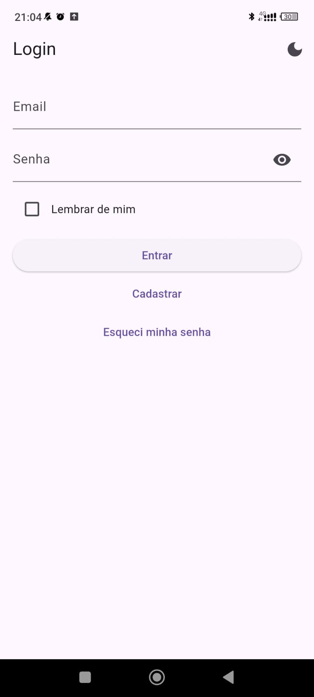 | 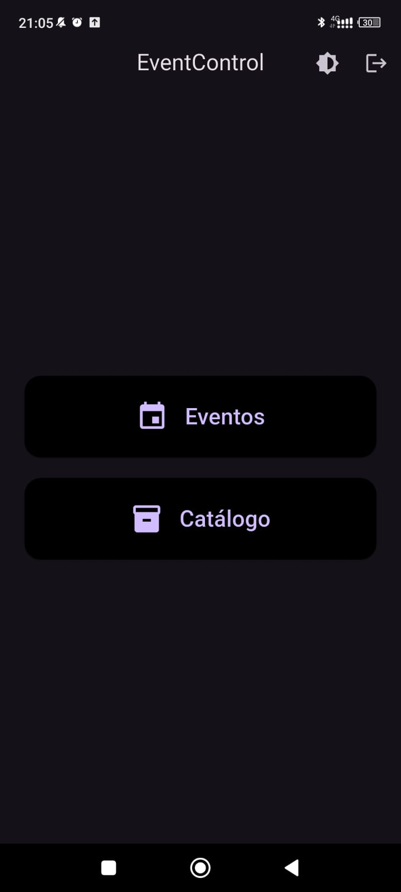 | 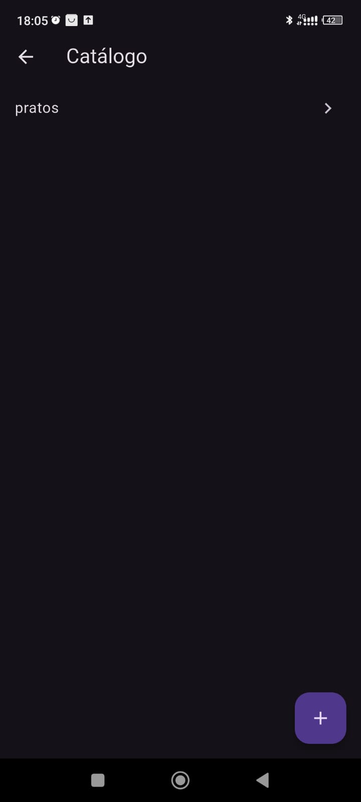 |

| Itens do catálogo | Dados do item | Novo item |
| --- | --- | --- |
| 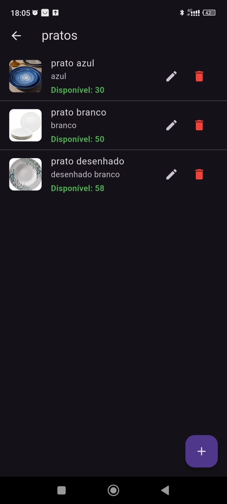 | 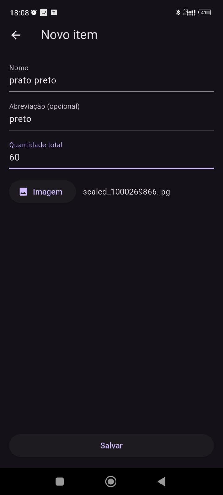 | 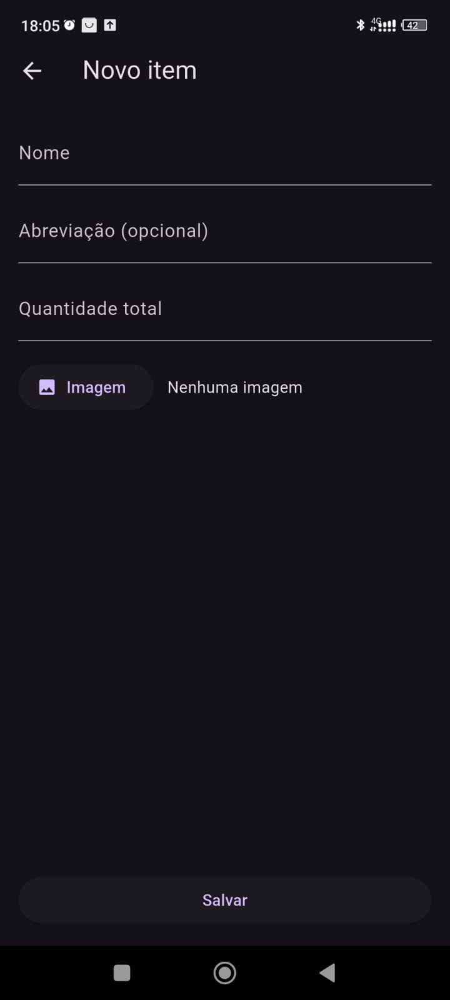 |

| Nova categoria | Novo item (nova categoria) | Edição no item |
| --- | --- | --- |
| 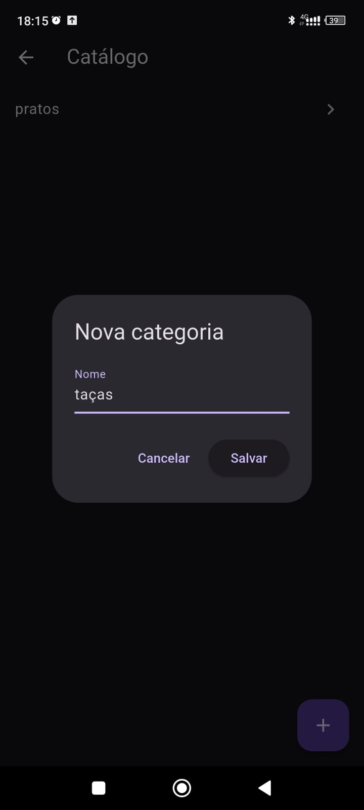 | 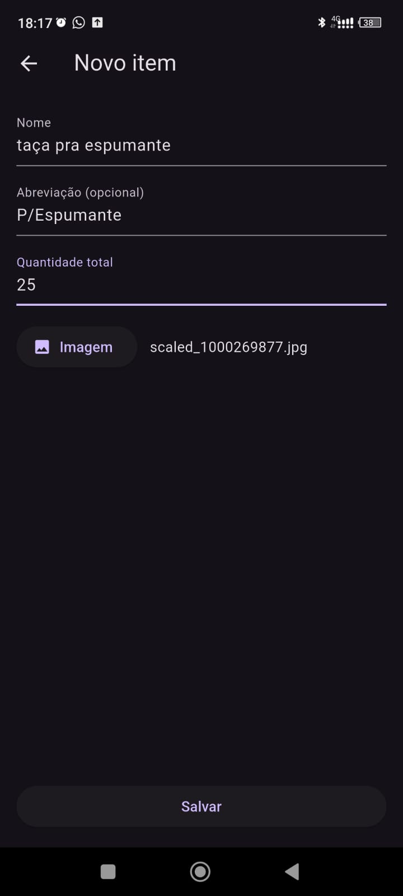 | 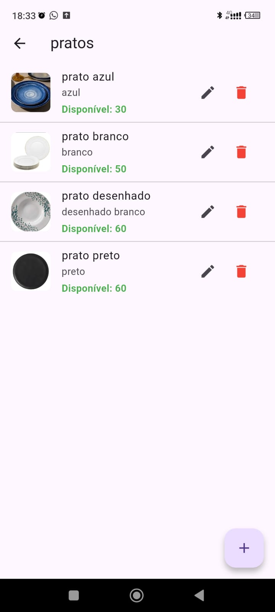 |

| Evento criado | Itens do evento | Adicionando itens no evento |
| --- | --- | --- |
| 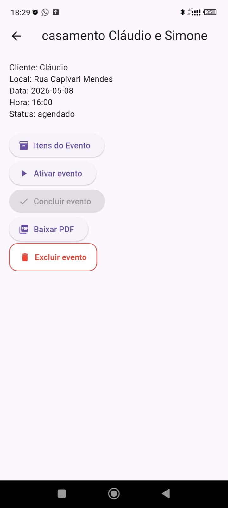 | 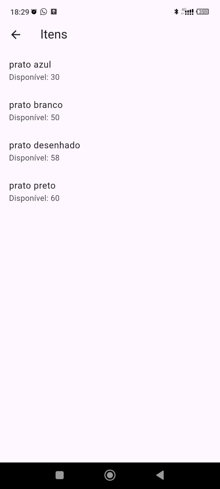 | 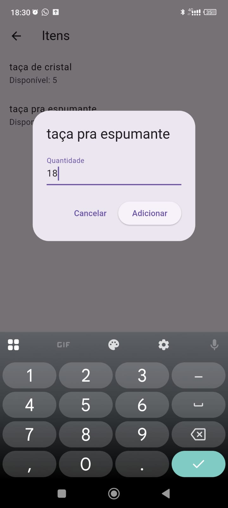 |

| Item adicionado | Modo escuro | PDF gerado |
| --- | --- | --- |
| 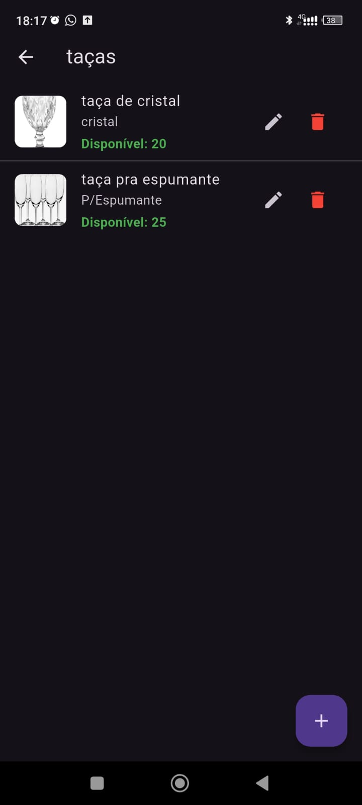 | 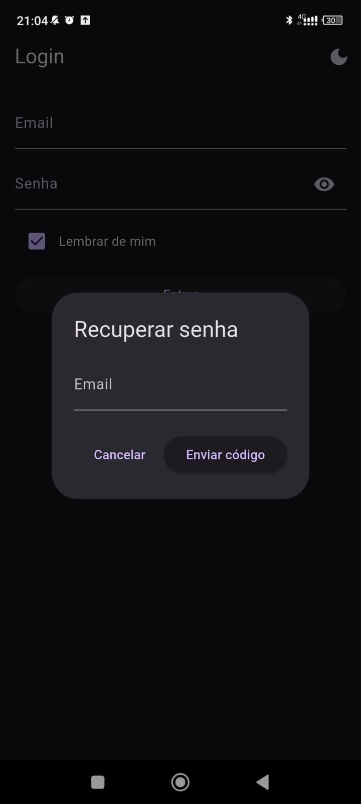 | 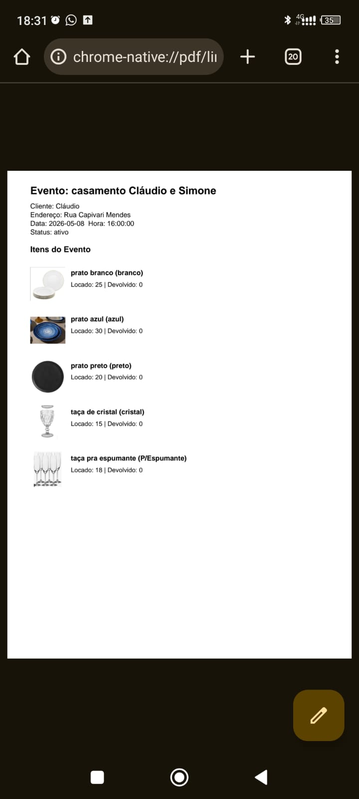 |

| Conclusão com devolução | Criando um evento | Alteração na disponibilidade |
| --- | --- | --- |
| 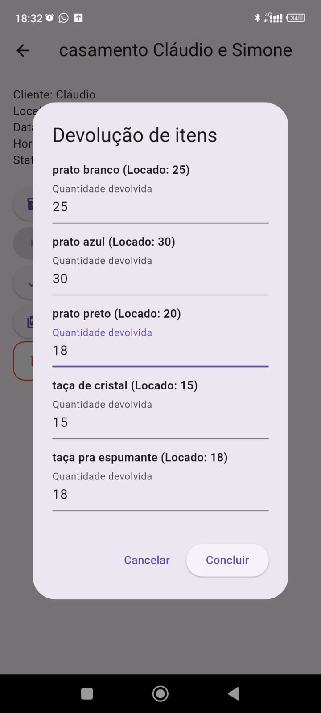 | 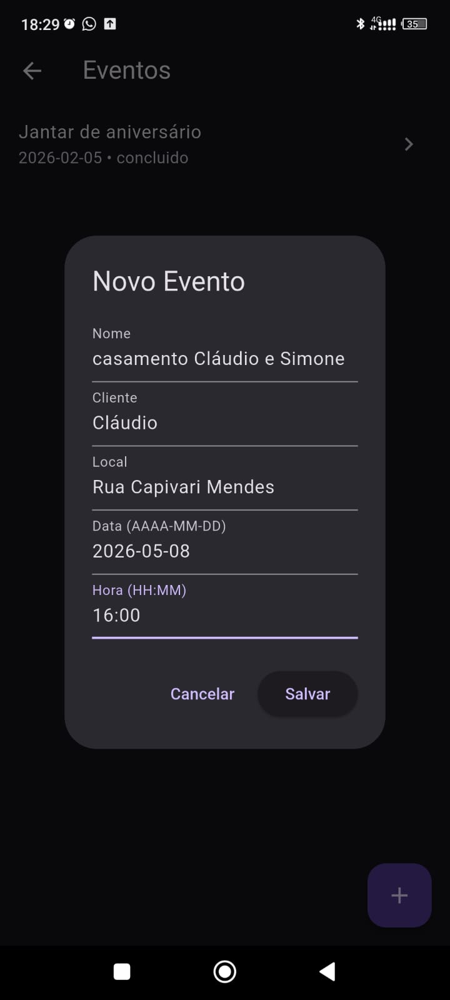 |  |

## Getting Started

This project is a starting point for a Flutter application.

A few resources to get you started if this is your first Flutter project:

- [Lab: Write your first Flutter app](https://docs.flutter.dev/get-started/codelab)
- [Cookbook: Useful Flutter samples](https://docs.flutter.dev/cookbook)

For help getting started with Flutter development, view the
[online documentation](https://docs.flutter.dev/), which offers tutorials,
samples, guidance on mobile development, and a full API reference.
